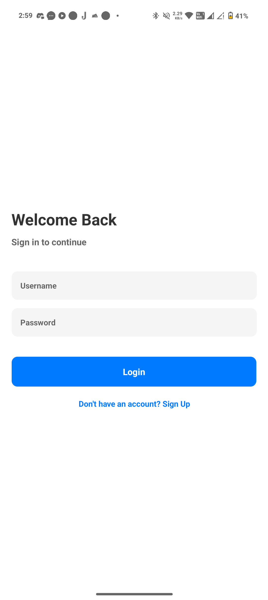
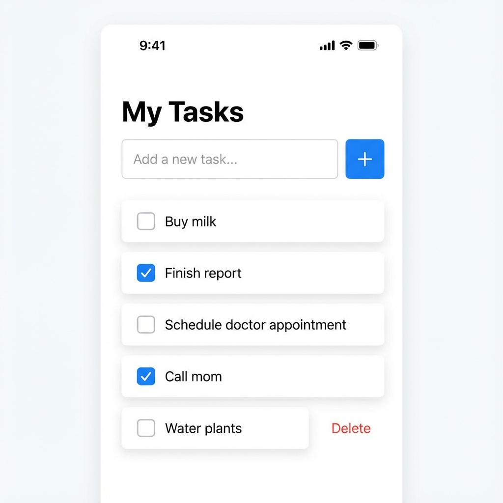
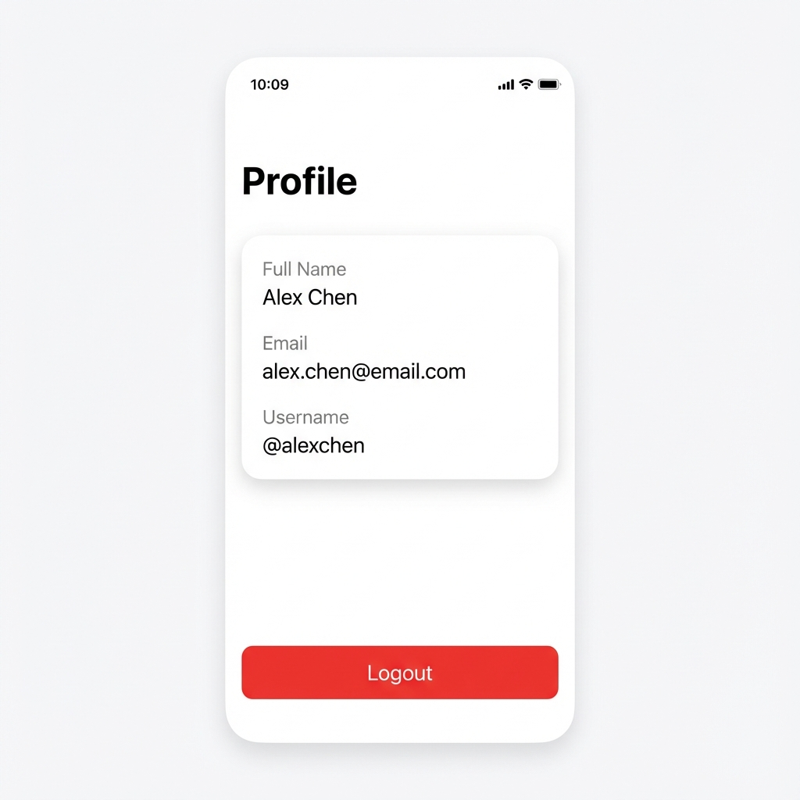

# Todo Mobile Application

A full-stack Todo application built with **React Native (Expo)** for the frontend and **FastAPI (Python)** for the backend.

## Features

- **User Authentication**: Secure Signup and Login using JWT (JSON Web Tokens).
- **Todo Management**: Create, Read, Update (Mark as Done), and Delete todos.
- **Profile**: View user details and Logout.
- **Cross-Platform**: Works on Android, iOS, and Web.
- **Real-time Feedback**: Visual confirmation for all actions.

## Screenshots

| Login Screen | Signup Screen |
|:---:|:---:|
|  |  |

| Dashboard | Profile |
|:---:|:---:|
|  |  |

## Tech Stack

- **Frontend**: React Native, Expo, Axios, React Navigation.
- **Backend**: FastAPI, SQLModel (SQLite), Passlib (Bcrypt), Python-Jose.

## Getting Started

### Prerequisites

- Node.js & npm
- Python 3.8+
- Expo Go app (for mobile testing)

### 1. Backend Setup

```bash
# Navigate to the root directory
cd todo

# Create a virtual environment
python -m venv backend/.venv

# Activate the virtual environment
# Windows:
backend\.venv\Scripts\activate
# Mac/Linux:
# source backend/.venv/bin/activate

# Install dependencies
pip install -r backend/requirements.txt

# Start the server
uvicorn backend.main:app --reload --host 0.0.0.0 --port 8000
```

### 2. Frontend Setup

```bash
# Navigate to the frontend directory
cd frontend

# Install dependencies
npm install

# Start the app
npx expo start
```

## API Documentation

The backend runs on `http://localhost:8000` (or your local IP).

### 1. Signup

**Endpoint**: `POST /auth/signup`

```bash
curl -X 'POST' \
  'http://localhost:8000/auth/signup' \
  -H 'Content-Type: application/json' \
  -d '{
  "username": "lokesh",
  "email": "lokesh@gmail.com",
  "full_name": "Lokesh",
  "password": "lokesh"
}'
```

### 2. Login (Get Token)

**Endpoint**: `POST /auth/token`

```bash
curl -X 'POST' \
  'http://localhost:8000/auth/token' \
  -H 'Content-Type: application/x-www-form-urlencoded' \
  -d 'username=lokesh&password=lokesh'
```

**Response**:
```json
{
  "access_token": "eyJhbGciOiJIUzI1Ni...",
  "token_type": "bearer"
}
```

### 3. Get Todos

**Endpoint**: `GET /todos/`
**Headers**: `Authorization: Bearer <your_access_token>`

```bash
curl -X 'GET' \
  'http://localhost:8000/todos/' \
  -H 'Authorization: Bearer <your_access_token>'
```

### 4. Create Todo

**Endpoint**: `POST /todos/`
**Headers**: `Authorization: Bearer <your_access_token>`

```bash
curl -X 'POST' \
  'http://localhost:8000/todos/' \
  -H 'Authorization: Bearer <your_access_token>' \
  -H 'Content-Type: application/json' \
  -d '{
  "title": "Buy groceries"
}'
```

### 5. Update Todo (Mark Complete)

**Endpoint**: `PATCH /todos/{todo_id}`
**Headers**: `Authorization: Bearer <your_access_token>`

```bash
curl -X 'PATCH' \
  'http://localhost:8000/todos/1' \
  -H 'Authorization: Bearer <your_access_token>' \
  -H 'Content-Type: application/json' \
  -d '{
  "completed": true
}'
```

### 6. Delete Todo

**Endpoint**: `DELETE /todos/{todo_id}`
**Headers**: `Authorization: Bearer <your_access_token>`

```bash
curl -X 'DELETE' \
  'http://localhost:8000/todos/1' \
  -H 'Authorization: Bearer <your_access_token>'
```
